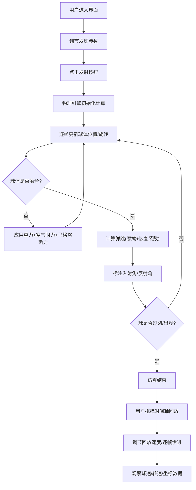

## 1. 产品概述

乒乓球发球旋转仿真工具，通过3D可视化帮助初学者直观理解不同旋转类型对球轨迹的影响。解决"上旋球往下扎、下旋球往上飘"等抽象概念难以想象的问题。

- **目标用户**：乒乓球初学者、教练、物理教育工作者
- **核心价值**：将旋转物理效应转化为可交互、可观测的3D动态演示

---

## 2. 核心功能

### 2.1 功能模块

1. **首页/主界面**：左侧参数控制面板 + 右侧3D仿真场景 + 底部时间轴控制

### 2.2 页面详情

| 页面名称 | 模块名称 | 功能描述 |
|-----------|-------------|---------------------|
| 主界面 | 参数控制面板 | 发球速度(5-25m/s)、旋转类型(上旋/下旋/侧旋/侧上旋/侧下旋)、转速(500-5000rpm)、发球角度、抛球高度 |
| 主界面 | 3D仿真场景 | 乒乓球台、球网、球体(经纬线纹理)、物理轨迹模拟、弹跳效果 |
| 主界面 | 轨迹可视化 | 彩色轨迹线(不同旋转不同颜色)、实时描绘飞行路径 |
| 主界面 | 弹跳标注 | 弹跳点显示入射角/反射角标注 |
| 主界面 | 时间轴控制 | 可拖拽进度条、慢速回放(0.1x-1x)、逐帧步进、实时数据显示(球速/转速/坐标) |

---

## 3. 核心流程

用户调节参数 → 点击"发射"按钮 → 物理仿真引擎计算球的运动(考虑重力、空气阻力、马格努斯效应) → 3D场景实时渲染球体运动和轨迹 → 球落地触发弹跳物理模型 → 完成发球-弹跳-过网全过程 → 用户可拖拽时间轴回放任意时刻 → 切换慢速/逐帧模式观察细节

---

## 4. 用户界面设计

### 4.1 设计风格

- **主色调**：深邃深蓝(#0A1628)背景 + 翡翠绿(#10B981)强调色(代表球台) + 橙色(#F59E0B)活力色(代表球和能量)
- **辅助色**：不同旋转类型颜色映射：上旋=橙红、下旋=青蓝、侧旋=紫色、侧上旋=橙粉、侧下旋=青绿
- **字体**：标题使用"JetBrains Mono"等宽科技感字体；正文使用"PingFang SC"中文无衬线字体
- **布局**：三栏式布局(左控制区25% + 中3D场景65% + 右侧信息浮层10%)
- **风格关键词**：科技感、运动感、数据可视化、深色主题、实验室氛围

### 4.2 页面设计概览

| 页面名称 | 模块名称 | UI元素 |
|-----------|-------------|-------------|
| 主界面 | 控制面板 | 滑块组件、分段选择器、数字输入框、发射/重置按钮组 |
| 主界面 | 3D场景 | 全屏Canvas、玻璃质感信息浮层、发光轨迹线、标注箭头 |
| 主界面 | 时间轴 | 渐变进度条、播放控制按钮组、数据指标卡片 |
| 主界面 | 信息显示 | 实时球速表、转速表、三维坐标显示、弹跳点标注气泡 |

### 4.3 响应式设计

- **桌面端优先**：≥1280px 使用三栏布局
- **平板端**：768-1279px 控制面板折叠为顶部抽屉
- **移动端**：<768px 单列垂直布局，3D场景优先

### 4.4 3D场景指导

- **环境**：深色实验室风格背景，轻微体积光效果，地面带网格线参考
- **光照**：主方向光模拟顶灯 + 两个补光消除阴影 + 球体自发光材质增强可见性
- **相机**：默认第三人称斜角45°俯视，支持鼠标拖拽旋转/缩放/平移，提供预设视角按钮(发球视角、侧视角、俯视)
- **球台**：标准乒乓球台尺寸(2740×1525×760mm)，墨绿色台面带白色边线，网柱+球网
- **球体**：直径40mm，橙色乒乓球材质，表面绘制黑色经纬线网格(类似地球仪)用于可视化旋转
- **轨迹**：使用TubeGeometry构建管道状轨迹，渐变透明尾迹效果
- **后处理**：轻微Bloom发光效果让轨迹和球体更醒目

---
