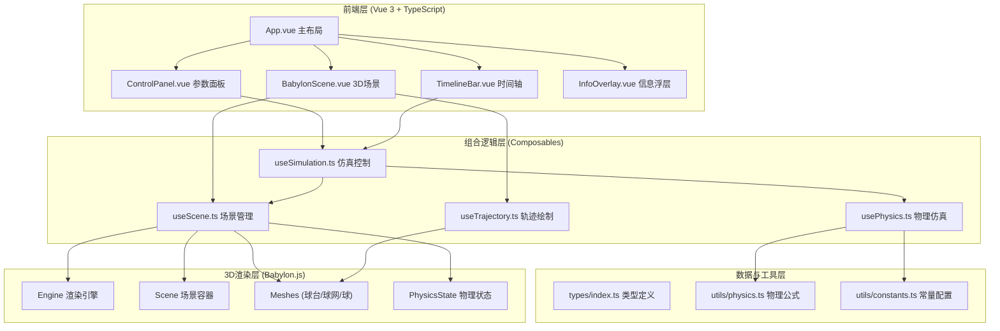

## 1. 架构设计



---

## 2. 技术说明

- **前端框架**：Vue 3 (Composition API) + TypeScript 5.0
- **构建工具**：Vite 5.0 (Vue-TS模板)
- **样式方案**：TailwindCSS 3.4 + 自定义CSS变量主题系统
- **3D引擎**：Babylon.js 7.0 (@babylonjs/core + @babylonjs/loaders)
- **状态管理**：Vue 3 响应式系统 (ref/reactive) + Pinia(按需)
- **UI组件**：原生HTML组件 + 自定义滑块组件(无需额外UI库)
- **图标**：Lucide Icons (lucide-vue-next)
- **容器化**：Docker + nginx:alpine 静态托管

---

## 3. 路由定义

| 路由路径 | 页面组件 | 用途 |
|---------|---------|------|
| `/` | `SimulationPage.vue` | 乒乓球旋转仿真主界面 |

---

## 4. 核心数据模型

### 4.1 发球参数 (ServeParams)

```typescript
interface ServeParams {
  speed: number;          // 发球初速度 m/s (5-25)
  spinType: SpinType;     // 旋转类型
  spinRate: number;       // 转速 rpm (500-5000)
  serveAngleX: number;    // 水平发球角度(左右) 度 (-30 ~ 30)
  serveAngleY: number;    // 垂直发球角度(上下) 度 (-10 ~ 30)
  tossHeight: number;     // 抛球高度 m (0.1 ~ 0.5)
}

type SpinType = 'topspin' | 'backspin' | 'sidespin_left' | 
                'sidespin_right' | 'topside_left' | 'topside_right' |
                'backside_left' | 'backside_right';
```

### 4.2 物理状态 (PhysicsState)

```typescript
interface PhysicsState {
  position: Vector3;      // 球心位置 (m)
  velocity: Vector3;      // 速度向量 (m/s)
  angularVel: Vector3;    // 角速度向量 (rad/s)
  time: number;           // 当前仿真时间 (s)
  hasBounced: boolean;    // 是否已弹跳
  bounceCount: number;    // 弹跳次数
}
```

### 4.3 仿真帧数据 (SimFrame)

```typescript
interface SimFrame {
  time: number;
  position: { x: number; y: number; z: number };
  velocity: { x: number; y: number; z: number };
  speed: number;          // 瞬时速度标量
  spinRate: number;       // 转速 rpm
  rotation: { x: number; y: number; z: number };  // 球体姿态(四元数转欧拉角)
  bounceEvent?: BounceEvent;
}

interface BounceEvent {
  position: Vector3;
  incidentAngle: number;   // 入射角(度)
  reflectAngle: number;    // 反射角(度)
}
```

### 4.4 仿真控制状态 (SimControl)

```typescript
interface SimControl {
  isPlaying: boolean;
  isPaused: boolean;
  playbackSpeed: number;   // 0.1 ~ 1.0
  currentFrame: number;
  totalFrames: number;
  frames: SimFrame[];      // 预计算帧缓存
  duration: number;        // 总时长(秒)
}
```

---

## 5. 物理模型算法

### 5.1 运动方程 (RK4数值积分)

考虑的作用力：
1. **重力**：`F_g = m * g * (0, -1, 0)`，g=9.81 m/s²
2. **空气阻力**：`F_d = -0.5 * ρ * C_d * A * |v| * v`
   - ρ=1.225 kg/m³ (空气密度)
   - C_d=0.4 (球体阻力系数)
   - A=πr² (横截面积，r=0.02m)
3. **马格努斯力(旋转升力)**：`F_m = S * (ω × v)`
   - S = 0.5 * ρ * C_l * A * r (经验系数)
   - C_l ≈ 0.2~0.4 升力系数
   - ω=角速度向量，v=速度向量

### 5.2 弹跳模型

碰撞检测：`position.y - r <= tableHeight` (台面高度0.76m)

弹跳后速度更新：
- **法向分量**：`v_y' = -e * v_y`，e=0.82 (恢复系数)
- **切向分量**：考虑球台摩擦
  - 摩擦力导致切向速度变化：Δv_t = -μ * (1+e) * |v_y| * v_t方向
  - 摩擦力同时改变角速度：Δω = (5μ(1+e)|v_y|)/(2r) * 垂直于v_t的方向
  - μ=0.25 (球台动摩擦系数)

### 5.3 旋转类型到角速度向量映射

| 旋转类型 | 角速度方向 (右手坐标系) | 效果描述 |
|---------|----------------------|---------|
| 上旋 topspin | ω = (ω, 0, 0) (绕X轴) | 球向前旋转，轨迹向下弯曲 |
| 下旋 backspin | ω = (-ω, 0, 0) | 球向后旋转，轨迹向上飘 |
| 左侧旋 sidespin_left | ω = (0, 0, ω) (绕Z轴) | 球顺时针旋转(俯视)，轨迹向左弯 |
| 右侧旋 sidespin_right | ω = (0, 0, -ω) | 球逆时针旋转，轨迹向右弯 |
| 侧上旋 topside | ω = (ω, 0, ±ω) 合成 | 上旋+侧旋合成效果 |
| 侧下旋 backside | ω = (-ω, 0, ±ω) 合成 | 下旋+侧旋合成效果 |

---

## 6. 项目目录结构

```
6108/
├── src/
│   ├── components/
│   │   ├── ControlPanel.vue      # 参数控制面板
│   │   ├── BabylonScene.vue      # 3D场景容器
│   │   ├── TimelineBar.vue       # 时间轴控制
│   │   ├── InfoOverlay.vue       # 实时数据浮层
│   │   ├── BounceMarker.vue      # 弹跳点标注
│   │   └── SpinSelector.vue      # 旋转类型选择器
│   ├── composables/
│   │   ├── usePhysics.ts         # 物理仿真引擎
│   │   ├── useSimulation.ts      # 仿真控制(播放/回放/逐帧)
│   │   ├── useScene.ts           # Babylon场景管理
│   │   └── useTrajectory.ts      # 轨迹线管理
│   ├── utils/
│   │   ├── physics.ts            # 物理公式/数值积分
│   │   ├── constants.ts          # 物理常量/颜色映射
│   │   └── helpers.ts            # 辅助函数
│   ├── types/
│   │   └── index.ts              # TypeScript类型定义
│   ├── pages/
│   │   └── SimulationPage.vue    # 主页面
│   ├── App.vue
│   ├── main.ts
│   └── style.css
├── public/
├── Dockerfile
├── docker-compose.yml
├── nginx.conf
├── package.json
├── vite.config.ts
├── tsconfig.json
├── tailwind.config.js
└── postcss.config.js
```

---
